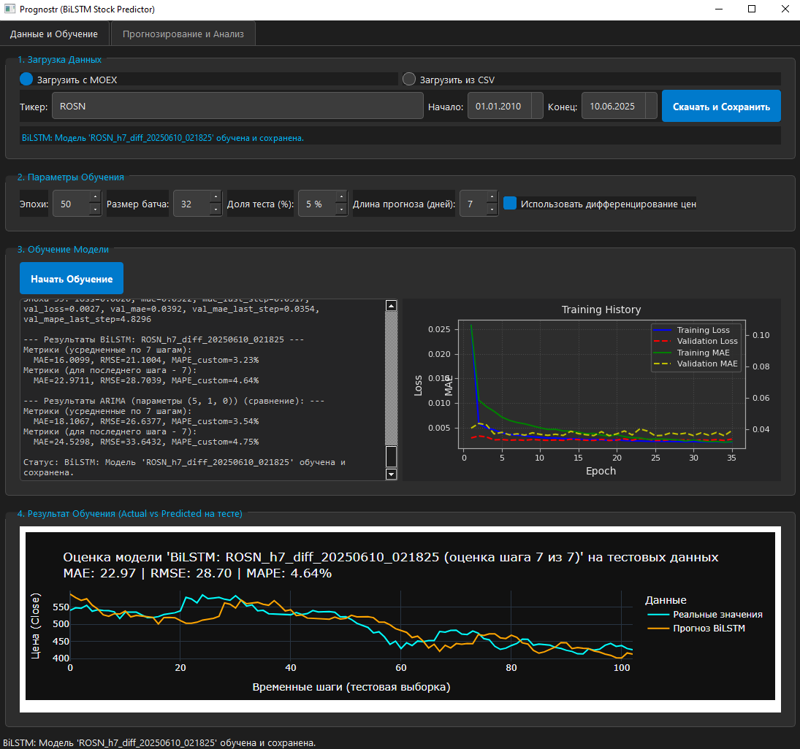

# Prognostr: Приложение для прогнозирования цен акций с BiLSTM

**Prognostr** — это десктоп-приложение, разработанное в рамках дипломной работы, предназначенное для анализа и прогнозирования временных рядов цен акций с использованием рекуррентных нейронных сетей (BiLSTM).

 
*(Примечание: Нужно сделать скрин `assets/screenshots/app_screenshot.png`)*

## 🌟 Ключевые особенности

- **Интерактивный GUI**: Построен на фреймворке PySide6 (Qt6).
- **Гибкая загрузка данных**: Поддержка загрузки актуальных данных с Московской биржи (MOEX) и из локальных CSV-файлов.
- **Модель BiLSTM**:
    - Двунаправленная LSTM-архитектура для улавливания зависимостей в данных в обоих направлениях.
    - **Кастомная взвешенная функция потерь**: Придает больший вес ошибкам на более дальних шагах прогноза, что критически важно для задачи многошагового прогнозирования.
    - **Дифференцирование ряда**: Возможность обучения модели на разностях цен для работы со стационарными рядами.
- **Сравнение с базовой моделью**: Встроенная оценка производительности на классической модели **ARIMA** с использованием методологии Walk-Forward Validation для объективного сравнения.
- **Асинхронные операции**: Все долгие процессы (загрузка данных, обучение модели) выполняются в фоновых потоках, обеспечивая отзывчивость интерфейса.
- **Интерактивная визуализация**:
    - Графики обучения (Loss, MAE) в реальном времени с помощью Matplotlib.
    - Интерактивные графики прогнозов и анализа с техническими индикаторами (SMA, Bollinger Bands, RSI) на базе Plotly.
- **Управление моделями**: Сохранение, загрузка и переключение между обученными моделями.

## 🛠️ Технологический стек

- **Язык программирования**: Python 3.10
- **GUI**: PySide6 (Qt for Python)
- **Машинное обучение**: TensorFlow (Keras)
- **Анализ данных**: Pandas, NumPy, Scikit-learn, Statsmodels
- **Визуализация**: Matplotlib, Plotly
- **Сетевые запросы**: Requests

## 🚀 Установка и запуск

Для запуска приложения выполните следующие шаги.

### 1. Предварительные требования

- Python 3.10.
- `pip`.

### 2. Клонирование репозитория

```bash
git clone https://github.com/ArturBobin/Prognostr.git
cd Prognostr
```

### 3. Создание виртуального окружения

Рекомендуется использовать виртуальное окружение для изоляции зависимостей проекта.

**Windows:**
```bash
python -m venv venv
venv\Scripts\activate
```

**macOS / Linux:**
```bash
python3 -m venv venv
source venv/bin/activate
```

### 4. Установка зависимостей

Установите все необходимые библиотеки с помощью файла `requirements.txt`.

```bash
pip install -r requirements.txt
```

### 5. Запуск приложения

После успешной установки зависимостей запустите главный файл приложения:

```bash
python main.py
```
При первом запуске приложение автоматически создаст необходимые директории `assets/data` и `assets/models`.

## 📖 Как пользоваться приложением

### Вкладка "Данные и Обучение"
1.  **Загрузка данных**:
    - Выберите источник: "Загрузить с MOEX" или "Загрузить из CSV".
    - Для MOEX введите тикер акции (например, `SBER`), укажите диапазон дат и нажмите "Скачать и Сохранить".
    - Для CSV выберите соответствующий файл.
2.  **Параметры обучения**:
    - Установите количество эпох, размер батча и долю тестовой выборки.
    - Выберите, использовать ли **дифференцирование цен** (рекомендуется для улучшения стационарности ряда).
3.  **Обучение**:
    - Нажмите "Начать Обучение".
    - Наблюдайте за процессом в реальном времени: прогресс-бар, лог метрик и график потерь будут обновляться.
    - После обучения в логе появятся итоговые метрики для BiLSTM и сравнительной модели ARIMA.

### Вкладка "Прогнозирование и Анализ"
1.  **Выбор модели**:
    - Только что обученная модель станет активной автоматически.
    - Вы также можете выбрать любую ранее сохраненную модель из выпадающего списка и нажать "Загрузить Выбранную".
2.  **Построение прогноза**:
    - Нажмите "Сделать Прогноз". Приложение загрузит самые свежие данные и построит прогноз на будущее.
3.  **Анализ**:
    - Изучите текстовый прогноз и интерактивный график.
    - Используйте чекбоксы для добавления и удаления технических индикаторов на графике для более глубокого анализа.

## 🏛️ Структура проекта
```
stock_predictor_project/
├── main.py                # Точка входа в приложение
├── requirements.txt       # Список зависимостей
├── README.md              # Этот файл
│
├── app/                   # Основной код приложения
│   ├── ui/                # Модули пользовательского интерфейса (PySide6)
│   ├── core/              # Ядро приложения (загрузка, обработка, обучение, предсказание)
│   ├── plotting/          # Генераторы графиков (Plotly, Matplotlib)
│   └── utils/             # Конфигурация и утилиты
│
└── assets/                # Ресурсы
    ├── models/            # Сохранённые модели
    ├── data/              # Сохранённые CSV файлы с данными
    └── screenshots/       # Скриншоты для README
```
---
**Автор**: Бобин Артур Тимурович
**Научный руководитель**: Близнюк Ольга Николаевна
**Университет**: Ярославский государственный технический университет, 2025 год
